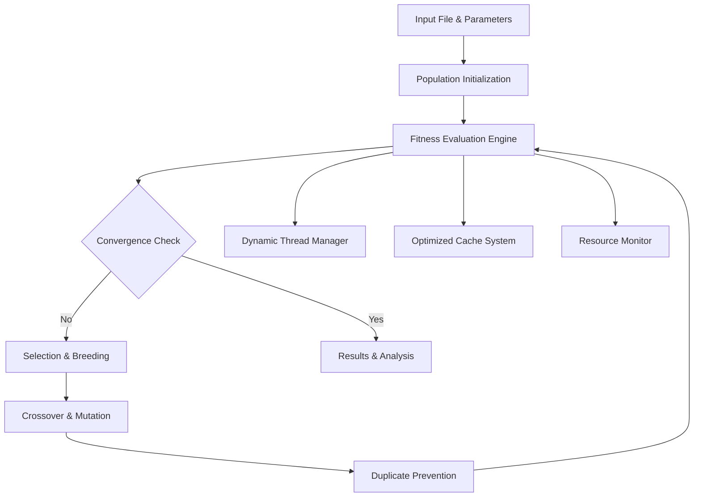

# Genetic Algorithm for Data Compression Parameter Optimization

[](https://www.python.org/downloads/)
[](LICENSE)

## Overview

This repository implements an **enterprise-grade genetic algorithm system** designed to optimize compression parameters for multiple data compression algorithms. The system uses evolutionary computation to automatically discover optimal parameter configurations that maximize compression efficiency for any given dataset.

### Supported Compression Algorithms

- **Zstandard (ZSTD)** - Fast compression with excellent ratios
- **LZMA** - Maximum compression with configurable complexity
- **Brotli** - Web-optimized compression algorithm
- **PAQ8** - Ultra-high compression ratios (experimental)
- **AC2** - Arithmetic coding with adaptive context modeling

---

## Key Features

### Advanced Genetic Algorithm Engine

- **Multi-threaded Population Evaluation** with dynamic thread scaling
- **Adaptive Parameter Tuning** (mutation/crossover rates)
- **Convergence Detection** with automatic termination
- **Elite Selection** with tournament-based breeding
- **Duplicate Prevention** to maintain population diversity

### Architecture

- **Modular Component Design** with clean separation of concerns
- **Comprehensive Error Handling** with custom exception hierarchy
- **Caching System** with LRU eviction and multiprocess safety
- **Structured Logging** with contextual parameters and performance metrics
- **Configuration Management** with validation and type safety
- **Resource Management** with memory monitoring and timeout protection

### Extra Features

- **Dynamic Resource Allocation** based on system load and compressor complexity
- **Comprehensive Test Suite** with integration and performance testing
- ** Logging Infrastructure** replacing all print statements

---

## Installation & Setup

### Prerequisites

- Python 3.8 or higher
- Virtual environment (recommended)
- Optional: SLURM workload manager (for HPC cluster execution)

### Quick Start

```bash
# Clone the repository
git clone git@github.com:TextDate/Genetical-Algorithm.git
cd Genetical-Algorithm

# Create and activate virtual environment (REQUIRED)
python -m venv venv

# On Windows:
venv\Scripts\activate

# On Linux or macOS:
source venv/bin/activate

# Install dependencies  
pip install -r requirements.txt

# Verify installation
python -c "import genetic_algorithm; print('Installation successful!')"
```

## Usage

### Basic Execution

```bash
# Basic genetic algorithm execution
python main.py --compressor zstd --param_file config/params.json --input your_data.txt

# Example with specific parameters
python main.py --compressor lzma --param_file config/params.json --input dataset.sdf \
               --generations 50 --population_size 30 --max_threads 4
```

### Command Line Interface

```bash
python main.py --compressor <algorithm> --param_file config/params.json --input <file> [options]
```

#### Required Arguments

- `--compressor`: Compression algorithm (`zstd`, `lzma`, `brotli`, `paq8`, `ac2`)
- `--param_file`: Parameter space definition (JSON)
- `--input`: Input file for optimization

#### Optional Arguments

- `--generations`: Number of generations (default: from config/params.json)
- `--population_size`: Population size (default: from config/params.json)
- `--output_dir`: Results directory (default: auto-generated)
- `--max_threads`: Maximum parallel threads (default: 8)
- `--mutation_rate`: Initial mutation rate (default: 0.1)
- `--crossover_rate`: Initial crossover rate (default: 0.8)

### Configuration Example

**config/params.json** - Parameter Space Definition:

```json
{
    "ga_config": {
        "population_size": 50,
        "generations": 100,
        "mutation_rate": 0.1,
        "crossover_rate": 0.8,
        "max_threads": 20,
        "convergence_generations": 20
    },
    "zstd": {
        "level": [-50, -1, 0, 1, 2, 3, 4, 5, 6, 7, 8, 9, 10, 15, 22],
        "window_log": [10, 15, 20, 25, 27, 30],
        "chain_log": [6, 10, 15, 20, 25, 28],
        "strategy": [0, 1, 2, 3, 4, 5]
    },
    "lzma": {
        "dict_size": [65536, 131072, 1048576, 16777216, 134217728],
        "lc_lp": ["0,0", "1,1", "2,2", "3,0", "4,0"],
        "pb": [0, 1, 2, 3, 4],
        "nice_len": [16, 32, 64, 128, 273]
    }
}
```

### Example Workflow

```bash
# Quick optimization with lower resource requirements
python main.py --compressor zstd --input test_data/test_10mb.sdf \
               --generations 20 --population_size 20 --max_threads 4
```

---

## Repository Structure

```
Genetical-Algorithm/
├── Core System Entry Point
│   └── main.py                    # CLI entry point
│
├── Source Code (src/)
│   ├── main.py                    # Main CLI implementation
│   ├── genetic_algorithm.py       # Main GA orchestrator  
│   ├── ga_config.py              # Configuration management
│   ├── ga_constants.py           # Centralized constants
│   ├── ga_exceptions.py          # Error handling system
│   ├── ga_logging.py             # Structured logging
│   ├── cache.py                   # Legacy cache (backwards compatibility)
│   ├── multiprocess_cache.py      # File-based caching system
│   │
│   ├── ga_components/            # Genetic Algorithm Components
│   │   ├── algorithm_optimization.py    # Adaptive parameter tuning
│   │   ├── convergence_detection.py     # Early stopping logic
│   │   ├── duplicate_prevention.py      # Population diversity
│   │   ├── evaluation.py               # Fitness evaluation engine
│   │   ├── population_management.py     # Individual encoding/decoding
│   │   ├── selection.py                # Selection strategies
│   │   ├── crossover.py                # Crossover operations
│   │   ├── mutation.py                 # Mutation strategies
│   │   ├── compressor_registry.py      # Factory pattern for compressors
│   │   ├── dynamic_thread_manager.py   # Intelligent resource scaling
│   │   └── optimized_cache_manager.py  # Multi-compressor caching
│   │
│   └── Compressors/              # Compression Modules
│       ├── base_compressor.py      # Abstract base class
│       ├── zstd_compressor.py      # Zstandard implementation
│       ├── lzma_compressor.py      # LZMA implementation  
│       ├── brotli_compressor.py    # Brotli implementation
│       ├── paq8_compressor.py      # PAQ8 implementation
│       └── ac2_compressor.py       # AC2 implementation
│
├── Configuration
│   ├── params.json               # Parameter definitions
│   └── requirements.txt          # Dependency specifications
│
├── Data Files
│   ├── data/
│   │   ├── input_files/           # Sample input datasets
│   │   ├── test_data/             # Sample datasets for testing
│   │   └── Chem_Dataset/          # Chemistry dataset samples
│   │
│   └── temp/                     # Temporary directories
│       ├── temp_brotli/          # Brotli temp files
│       ├── temp_lzma/            # LZMA temp files
│       ├── test_temp/            # Test temp files
│       └── test_valid/           # Test validation files
│
├── Testing & Validation
│   ├── tests/
│   │   ├── test_integration.py     # End-to-end testing
│   │   ├── test_performance.py     # Performance benchmarks
│   │   ├── test_components.py      # Component unit tests
│   │   └── test_fixtures.py        # Test data and mocks
│   └── run_all_tests.py           # Test runner
│
├── Analysis & Results
│   ├── tools/                     # Analysis utilities
│   ├── docs/                      # Technical documentation  
│   ├── Extractors/               # Result extraction utilities
│   ├── Plots/                    # Plot generation scripts
│   └── ga_results_*/             # Generated results (per compressor)
│
└── External Dependencies
    ├── paq8px/                   # PAQ8 binaries and source
    ├── ac2/                      # AC2 compressor source
    └── GA/                       # SLURM job scripts
```

---

## System Architecture

### Genetic Algorithm Pipeline



### Core Components

#### 1. **Configuration Management (`ga_config.py`)**

```python
@dataclass
class GAConfig:
    population_size: int = 50
    generations: int = 100
    mutation_rate: float = 0.1
    crossover_rate: float = 0.8
    max_threads: int = 8
    enable_dynamic_thread_scaling: bool = True
    # ... comprehensive validation and defaults
```

#### 2. **Dynamic Resource Management**

- **Intelligent thread scaling** based on workload and system resources
- **Memory pressure detection** and automatic adjustment
- **Performance learning** from historical execution data

#### 3. **Error Handling & Recovery**

```python
# Custom exception hierarchy
CompressionError, CompressionTimeoutError, InvalidFitnessError
ParallelProcessingError, ConfigurationError, ResourceExhaustedError
```

---

## Advanced Configuration

### Example of SLURM Job Configuration for IEETA HPC (GA_trainer.sh)

```bash
#!/bin/bash
#SBATCH --job-name=GA_comp
#SBATCH --partition=cpu
#SBATCH --cpus-per-task=50
#SBATCH --mem=240G
#SBATCH --time=24:00:00
#SBATCH --output=%x-%j.out
#SBATCH --error=%x-%j.err

# Activate virtual environment
source /data/home/username/virtual-venv/bin/activate

# Navigate to project directory
cd /data/home/username/TextDate/Genetical-Algorithm

# Execute genetic algorithm
python main.py \
    --compressor lzma \
    --param_file config/params.json \
    --input test_data/test_10mb.sdf \
    --max_threads 20
```

### Parameter Space Optimization Example

#### LZMA Configuration

```json
{
    "lzma": {
        "dict_size": [1048576, 16777216, 134217728, 1073741824],
        "lc_lp": ["0,0", "1,1", "2,2", "3,1", "4,0"],
        "pb": [0, 2, 4],
        "nice_len": [32, 64, 128, 273],
        "mode": [0, 1],
        "mf": ["bt4", "hc4"],
        "depth": [0, 100, 1000]
    }
}
```

#### ZSTD Configuration

```json
{
    "zstd": {
        "level": [-5, 1, 3, 6, 9, 12],
        "window_log": [15, 20, 25],
        "chain_log": [10, 15, 20],
        "strategy": [1, 2, 3]
    }
}
```

---

## Performance & Results

### Example Results

```
=== Genetic Algorithm Results ===
Best Individual Found:
  Compressor: LZMA
  Fitness (Compression Ratio): 12.847
  Parameters: {
    'dict_size': 134217728,
    'lc_lp': '3,1', 
    'pb': 2,
    'nice_len': 128,
    'mode': 1,
    'mf': 'bt4',
    'depth': 100
  }

Performance Statistics:
  Generation: 35 (converged early)
  Total Evaluations: 1,750
  Cache Hit Rate: 73.2%
  Peak Memory Usage: 1.24 GB
  Total Runtime: 14.7 minutes
```

### Optimization Timeline

```
Generation 1:  Best Fitness = 8.234  | Avg = 6.891 | Population Diversity = 0.95
Generation 5:  Best Fitness = 9.567  | Avg = 7.823 | Population Diversity = 0.87
Generation 15: Best Fitness = 11.234 | Avg = 9.456 | Population Diversity = 0.72
Generation 25: Best Fitness = 12.456 | Avg = 10.789| Population Diversity = 0.68
Generation 35: Best Fitness = 12.847 | Avg = 11.234| Converged!
```

---

## Testing & Validation

### Test Suite Execution

```bash
# Run complete test suite
python run_all_tests.py

# Run specific test categories
python -m pytest tests/test_integration.py -v
python -m pytest tests/test_performance.py -v

# Run with coverage
python -m pytest --cov=. tests/
```

### Continuous Integration Testing

- **Integration Tests**: End-to-end GA pipeline validation
- **Component Tests**: Individual module functionality
- **Performance Tests**: Resource usage and scaling validation
- **Error Scenario Tests**: Exception handling and recovery

---

## Important Notes & Safety

### Resource Management Guidelines

**IMPORTANT FOR LARGE FIles**

- **Monitor system memory usage** when processing large files
- **Start with smaller files** to test configuration before scaling up
- **Use appropriate thread limits** based on your system capabilities
- **For HPC clusters**: Use SLURM job submission for resource-intensive operations

### Resource Management

- **Memory Monitoring**: Automatic warnings at 500MB, critical at 1GB
- **Timeout Protection**: Automatic termination of stuck compression operations
- **Thread Scaling**: Dynamic adjustment based on system load and compressor complexity
- **Cache Management**: Automatic cleanup and optimization

### Error Recovery

- **Graceful Degradation**: System continues operation despite individual failures
- **Comprehensive Logging**: All errors logged with context for debugging
- **Automatic Fallbacks**: Failed evaluations use minimum fitness values
- **Resource Protection**: Automatic scaling down on memory/CPU pressure

---

## Research & Development

### Academic Context

This work was developed under the supervision of:

- **Investigator Diogo Pratas**
- **Professor Armando Pinho**
- **Institution**: IEETA (Institute of Electronics and Informatics Engineering of Aveiro)
- **Program**: Initiation to Investigation Scholarship

### Publications & References

- None

### Future Development

- **Multi-objective optimization** (compression ratio vs. speed)
- **Hybrid algorithm support** (combining multiple compressors)
- **Real-time parameter adaptation** during compression
- **Distributed computing** across multiple nodes

---

## License & Contributing

### License

This project is licensed under the MIT License - see [LICENSE](LICENSE) file for details.

### Contributing Guidelines

1. **Follow existing code patterns** and architecture
2. **Add comprehensive tests** for new features
3. **Update documentation** including this README
4. **Ensure SLURM compatibility** for resource-intensive operations
5. **Maintain backwards compatibility** with existing configurations

---

## Support & Contact

- paulojnpinto02@ua.pt

---

### Getting Help

1. **Review system documentation** for configuration and usage
2. **Examine test results** in `test_results/` directory
3. **Check log files** from SLURM job outputs
4. **Run diagnostic tests** using the test suite

### Troubleshooting Common Issues

- **ModuleNotFoundError**: Ensure virtual environment is activated
- **Job Cancellation**: Monitor resource usage, reduce population size if needed
- **Memory Issues**: Use dynamic thread scaling and monitor with `squeue`
- **Cache Issues**: Clear cache with `rm -rf .optimized_cache/` if needed

---

*Last Updated: 2025-09-01*
